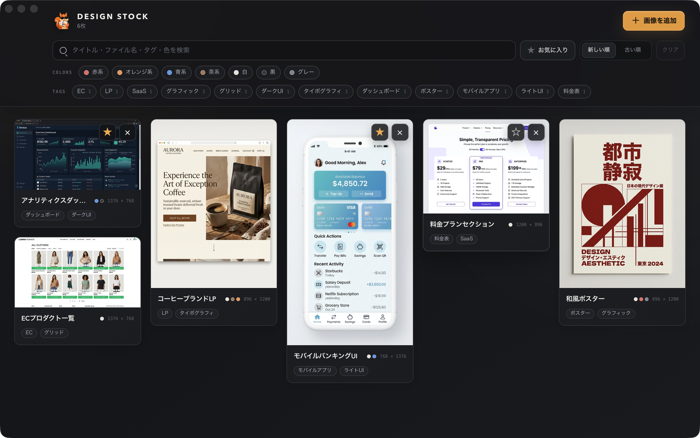

<p align="center">
  
</p>

<h1 align="center">Design Stock</h1>

<p align="center">デザインのスクリーンショットをローカルに保存し、整理できるmacOSアプリです。<br/>
Local-first design screenshot organizer for macOS.</p>



## 主な機能

- ファイル選択、ドラッグ＆ドロップ、`⌘V`によるスクリーンショットの取り込み
- マソンリー形式のギャラリー表示
- ライトボックスでの前後移動（`←`、`→`）、`Esc`による終了、タイトルとタグの編集、お気に入り登録、削除、Finderでの表示
- タイトル、ファイル名、タグ、色名を対象としたテキスト検索
- タグのAND条件、色のOR条件、お気に入りによる絞り込みと並び替え
- 画像から最大3色を自動抽出（赤、オレンジ、黄、緑、青、紫、ピンク、茶、白、黒、グレー）
- Apple IntelligenceのオンデバイスFoundation ModelsとVisionによる、日本語タグの最大3件の自動付与
- Apple Intelligenceを利用できない環境では、Visionの分類ラベルへフォールバック

マスコットとアプリアイコンは、サングラスをかけたリスです。

## インストール

[GitHub Releases](https://github.com/iritec/design-stock/releases)から最新のdmgをダウンロードします。
dmgを開き、Design StockをApplicationsフォルダへドラッグしてください。

## プライバシー

Design Stockは完全にローカルで動作し、画像やタグなどのデータを外部へ送信しません。
データは`~/Library/Application Support/com.irie.designstock/`に保存されます。
AIによるタグ付けもデバイス上で処理され、画像がデバイス外へ送られることはありません。

## 動作要件

- macOS 26（Tahoe）以降
- Apple Silicon推奨
- AIタグのフル機能には、Apple Intelligenceが有効な環境が必要

## 開発

技術構成はTauri v2、React、TypeScript、Vite、Rustです。
AIタグ処理にはSwiftサイドカーを使用します。

開発には次の環境が必要です。

- Rust
- Node.js 22以降
- pnpm
- Xcode（`swiftc`を含む）

依存関係をインストールし、開発環境を起動します。

```sh
pnpm install
pnpm tauri dev
```

Rustのテストを実行します。

```sh
cd src-tauri
cargo test
```

配布用アプリをビルドします。

```sh
pnpm tauri build
```

## ライセンス

[MIT License](LICENSE)
